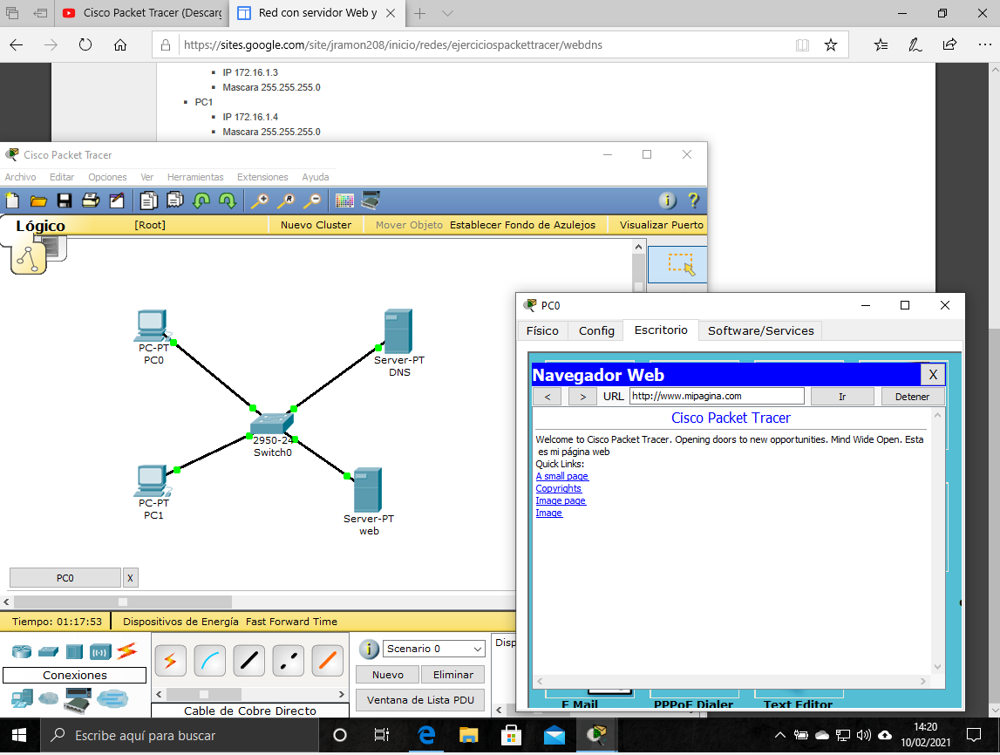
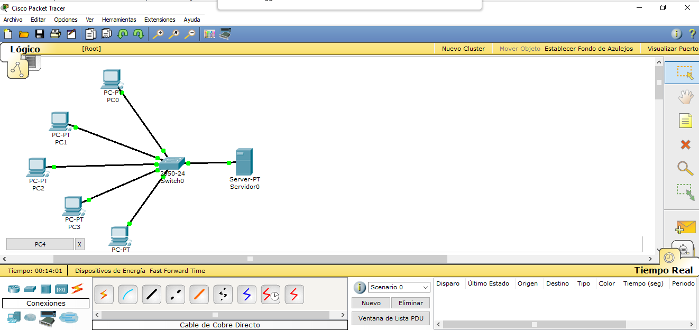
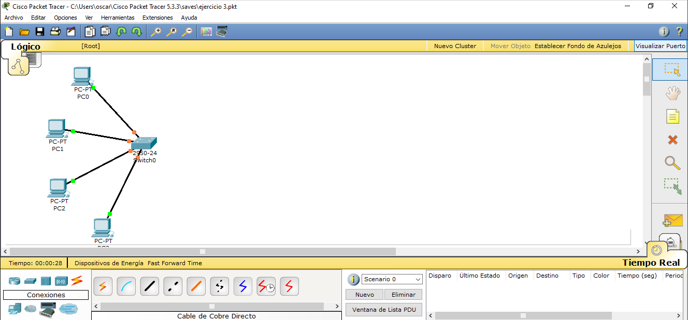
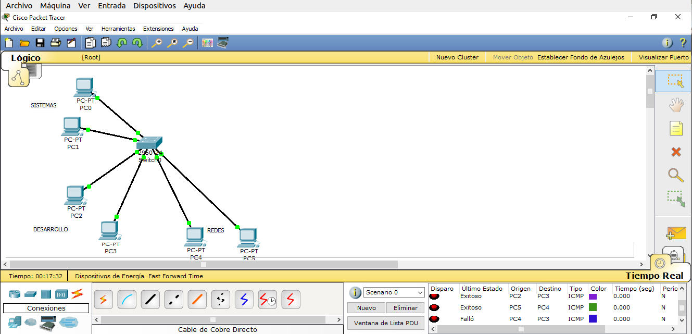
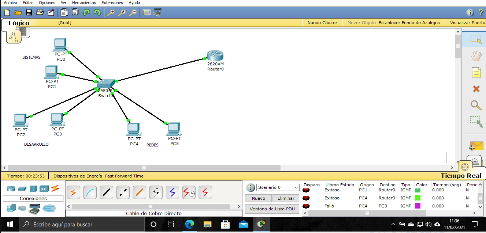
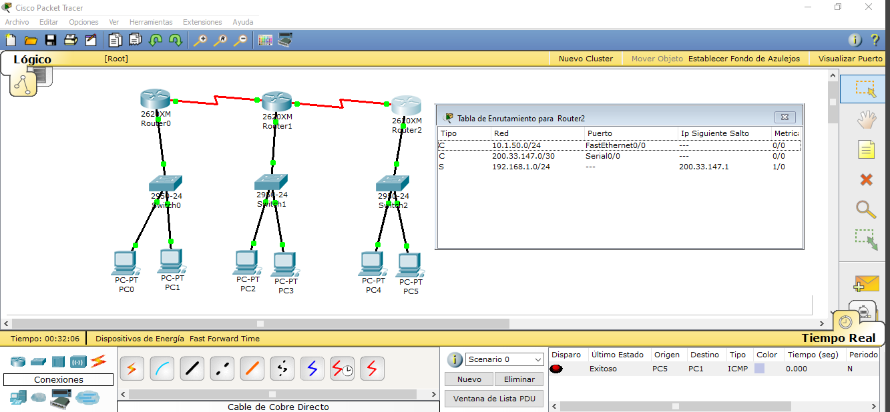

# Simulador de redes

Cada ejercicio está detallado en la parte inferior del readme.

En tareas anteriores hemos podido ver cómo funcionan las redes informáticas y cómo hoy en día es cada vez más complicado 
imaginar que hace no tanto tiempo las computadoras funcionaban como dispositivos aislados unos de otros. 
Sabemos también, que la red principal (la red de redes) es [Internet](https://concepto.de/internet/) y que hoy en día todo está interconectado en forma de red.

Podríamos encontrar diferentes definiciones sobre qué es una red pero quizás la más común:  
"un conjunto de dispositivos interconectados entre sí a través de un medio, que intercambian información y comparten recursos".

Hasta aquí todo correcto. El invento está GENIAL!!!  

Hemos ido resolviendo multitud de preguntas sobre estas redes:  

1.- ¿Qué tipos de redes existen? ¿Internet es la única red que existe?   
2.- ¿Cómo se comunican los dispositivos entre sí?  
3.- ¿Qué pintan los routers en todo esto?  
4.- ¿Tienen algo que ver la IP-s en todo este tinglado?  
5.- ¿Qué son las máscaras de subred?  
6.- ...  

Mmmmm.	por cierto, añadimos un par de videos ilustrativos sobre redes:

El primero es este VIDEO 1 que nos habla sobre redes en general.   
  
El segundo VIDEO 2 resuelve un ejercicio práctico para entender bien las máscaras de subred.  
  

Pues muy bien, en esta tarea, vamos a pasar de la teoría a la práctica y para ello vamos a utilizar un simulador de redes.  
[simulador de redes](https://mundowin.com/5-mejores-simuladores-de-red-para-imitar-una-red-de-ordenadores-en-vivo-en-un-pc/)
Existen diferentes marcas y en nuestro caso nos hemos inclinado por Packet Tracer de Cisco.  

Para realizar la tarea debes:

1.- [Instalar](https://www.youtube.com/results?search_query=instalar%2Bpacket%2Btracer) el software en tu ordenador.   
2.- [Empezar a entender](https://www.youtube.com/watch?v=aR032ROLdro) cómo trabajar con este software y a profundizar en conceptos adquiridos en anteriores tareas.  
3.- Montar en el simulador las siguientes redes (añadimos links con la resolución):  
    a.- [Red con servidor web y servidor de DNS](https://sites.google.com/site/jramon208/inicio/redes/ejerciciospackettracer/webdns)    
      
    [ejercicio 1](https://github.com/zumaia/theegg/blob/master/tarea_39/ejercicio%201.pkt)  
    b.- [Red con servidor DHCP](https://sites.google.com/site/jramon208/inicio/redes/ejerciciospackettracer/red-con-servidor-dhcp)  
      
    [ejercicio 2](https://github.com/zumaia/theegg/blob/master/tarea_39/ejercicio%202.pkt)  
    c.- [Red VLAN básica](https://sites.google.com/site/jramon208/inicio/redes/ejerciciospackettracer/red-vlan-bsica)  
      
    [ejercicio 3](https://github.com/zumaia/theegg/blob/master/tarea_39/ejercicio%203.pkt)  
    d.- [Unir dos redes VLAN con un router](https://sites.google.com/site/jramon208/inicio/redes/ejerciciospackettracer/unir-dos-redes-vlan-con-un-router-cisco)  
    
      
    [ejercicio 4](https://github.com/zumaia/theegg/blob/master/tarea_39/ejercicio%204.pkt)  
    e.- [Enrutamiento estático](https://sites.google.com/site/jramon208/inicio/redes/ejerciciospackettracer/enrutamiento-esttico)  
      
    [ejercicio 5](https://github.com/zumaia/theegg/blob/master/tarea_39/ejercicio%205.pkt)  

Nota:  
Incluimos un par de PDF-s a para ayudaros.

### HASHTAGS (etiquetas de ayuda para búsqueda de información relevante)

#### #redes-informáticas #internet #packet-tracer #Cisco #simulador

LINKS DE INTERÉS

DICCIONARIO

redes-informáticas | Internet  

PUNTUACIÓN

Programación: 1  
Redes: 10  
Seguridad: 4  
Algoritmia: 1  
